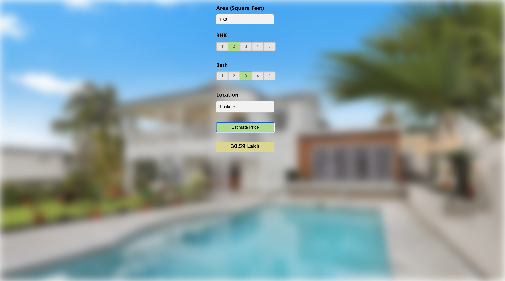

# Home Price Prediction

Projet de machine learning qui prédit le prix des maisons à partir de données.

## Aperçu

## Description
Ce projet utilise un modèle de machine learning entraîné en Python.
Une interface web permet d’envoyer des données et d’obtenir une prédiction.

## Structure
- client : interface web (HTML, CSS, JavaScript)
- server : serveur Python (Flask)
- model : entraînement du modèle et dataset

## Lancer le projet
1. Installer les dépendances :
pip install -r requirements.txt

2. Lancer le serveur :
python server/server.py

3. Ouvrir client/app.html dans le navigateur